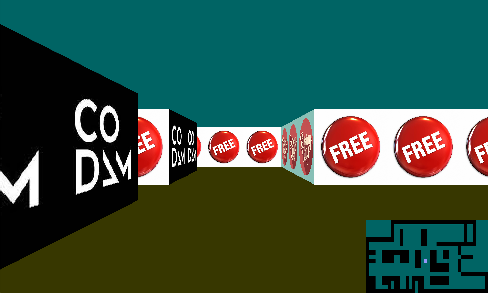
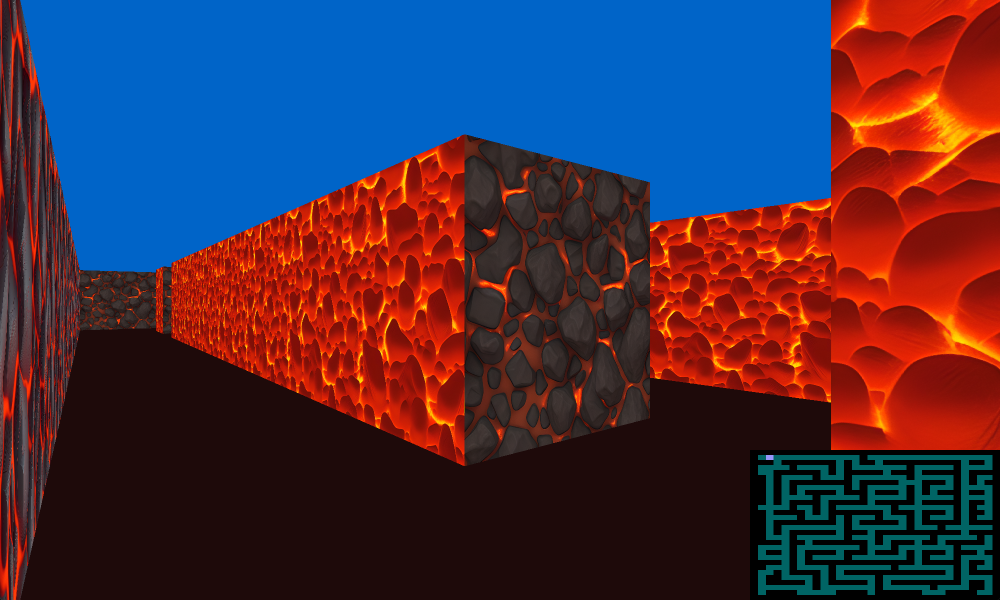

# CUB3D | CODAM

'My first RayCaster'

### Table of Contents
* [Introduction](#introduction)
* [How it Works](#how-it-works)
* [Instalation](#installing-the-mlx-library-and-required-recourses)
* [Running](#Running)
* [Learnings](#learnings)

## Introduction
CUB3D is an assignment for CODAM in which we are tasked to create a 3D looking environment based on a 2D map, to get familiar with a raycasting principles. At CODAM we have access to the the MLX42 library which can be found at [here: MLX42](https://github.com/codam-coding-college/MLX42/blob/master/docs/Basics.md). 

There is no intended goal to the game but if you like a challange navigate the maze map to the bottom right corner.

### Requirements
The environment must follow a set of rules. The executable ``cub3d`` will receive an input file as the only argument, and this file will have a ``.cub`` filetype.

The file also must follow these rules:
- Contain a map: The map must be composed of only 6 possible characters: 0 for  empty spaces, 1 for a walls, and N,S,E or W for the player’s start position and spawning orientation.

- The map must be closed / surrounded by walls.

- Contain texture data for the walls and color data for the ceiling and the floor

- Except for the map content which always has to be the last, each type of element can be set in any order in the file.

- Except for the map, each type of information from an element can be separated by one or more space(s).

- The map must be parsed as it looks in the file. Spaces are a valid part of the map and are up to you to handle.

- Each elements (except the map) firsts information is the type identifier (composed of one or two character(s)), followed by specific informations for each object in a strict order such as:

	`NO ./path_to_north_texture` for a wall texture and  
 `F 220,100,1` for floor color

- The program should display different wall textures that vary depending on which side the wall is facing (North, South, East, West)

- The program must be able to set the floor and ceiling colors seperatly

- Error handeling on all of these checks must exit the game in a clean manner and display `Error` followed by a custom message.

## How it Works

### Reading the map
After checking the parameters and extention we allocate a struct data where we store all relevant date. We initialize the underlying variables and allocate a few more structs for specific data like image data. We then used the our own custom  `get_next_line` function (an earlier project) to read the input data into one string which we can parse to get texture paths, colors and a map grid. A final test is done to determine if the map is enclosed using a flood-fill function.

### Starting
If all checks are passed the MLX window is initilized, the textures are loaded en then drawn to images which are placed in the window.

### Raycasting
We use raycasting to convert the 2D map to a 3D image. Per pixel on the screen we determine which part of which wall should be shown. To do so, we apply the following logic:

- The screen represents our field of view (FoV), we chose a 90 degrees horizontal FoV, and a 60 degrees vertical FoV.

- The player position is represented as an 'eye', which has a position on the grid and a viewing direction in the horizontal plane. E.g. the player might be on coordinate (3.25; 5.20), and be facing east. The eye remains at a height that is in the middle between the ceiling and the floor.

- For every pixel on the screen, we calculate the following properties:
  - The horizontal view angle: 
  
  	The view angle of the far left pixels equals the view angle of the eye minus 45 degrees; the view angle of the far right pixels equals the view angle of the eye plus 45 degrees.
  - The vertical view angle: 
	
	The view angle of the top line of pixels equals +30 degrees; the view angle of the bottom line of pixels equals -30 degrees
  - Based on the horizontal view angle and the player position, we calculate which wall is hit, and which part of that wall (the normalized horizontal hit is represented as number between 0 and 1)
  - Based on the wall section that is hit we calculate the distance of the wall that is seen while looking a specific horizontal view angle
  - Based on the wall distance and the vertical view angle, we calulate at what height we see the wall. A height higher than the wall height implies we see the ceiling, a negative height implies we see the floor.
  - The height is normalized relative to the wall heigh, so it is represented by a number between 0 and 1
  - Based on the wall that is hit, we select a wall texture, from which we need to display a pixel
  - We select an single pixel (i.e. its color) from the wall texture based on the normalized height and the normalized horizontal hit. E.g. if normalized horizontal and vertical values are 0.2 and 0.5 respectively, and the texture has 200 by 200 pixels, we select the pixel on the texture with x = 40, y = 100
  - The color of the selected pixel from the texture is the color we put on the screen on that specific pixel 

### Fish eye correction
A simple implementation of the raycasting technique might imply that the rendered 3D image has a fish eye effect. The fish eye effect means that the top and bottom lines of walls are displayed curved. Staight walls therefore, are displayed in a form that resembles an eye-shape instead of a rectangle.

The fish eye effect is a consequence of the distance calculation. If the distance is calculated relative to an eye that is in the middle of the screen, wall sections shown on the left and right side of the screen are displayed smaller, since they are considered further away. The eye-shape appears if wall sections in the center of the screen occupy more vertical space than wall sections on displayed on the sides of the screen.

To negate the fish eye effect, we calculate the distance of the wall relative to "camera plane" instead of a single poin (the eye). The camera plane is perpendicular to the viewing direction.

### Playing
Keybinding:
- `W A S D` controle player movement.
- Arrow keys `LEFT` and `RIGHT` and the mouse controle viewing direction (turing)
- `ESC` closes the environment.
- `M` toggles the mouse on or off.
- `R` toggles the mini map (radar) on or off.

### Collision 
The player hase a grid locationm (float) used to determing what they 'see' and to calculate valid moves and colissions.

## Installing the MLX library and required recourses
Please read the documentation for this in the [MLX42 repository](https://github.com/codam-coding-college/MLX42/blob/master/docs/Basics.md). It is self explenatory.

Cone this repository and run the make command. This works on MacOs and Linux. 
For windows please check the right installation requirements and compilation flags in the abovementioned documentation for [MLX42](https://github.com/codam-coding-college/MLX42/blob/master/docs/Basics.md).

Use the `make` command to compile the cub3d executable using the MLX42 lib.

## Running
Run `./cub3d ./maps/maze.cub` to run the environment. You can change the map (maze.cub) to any maps in the maps folder.

You can play with the values in the `config.h` file to tweak the screen position, size, movemnt rates and refresh rates. remember to use make re if you make changes here. 

## Suggestions for performance improvements
- Multithreading the pixelation of the main image.
- Starting of with and initial pixelation of the ceiling and floor in stead of a per pixel calculation.
- Seperate header files and static functions where possible.

## Authors:
- Christiaan Herrewijn
- Carlo Wesseling

SEPT 2023

For more information visit: [Codam.nl](https://codam.nl/) or [42 Cursus Subjects](https://github.com/Surfi89/42cursus/tree/main/Subject%20PDFs).
